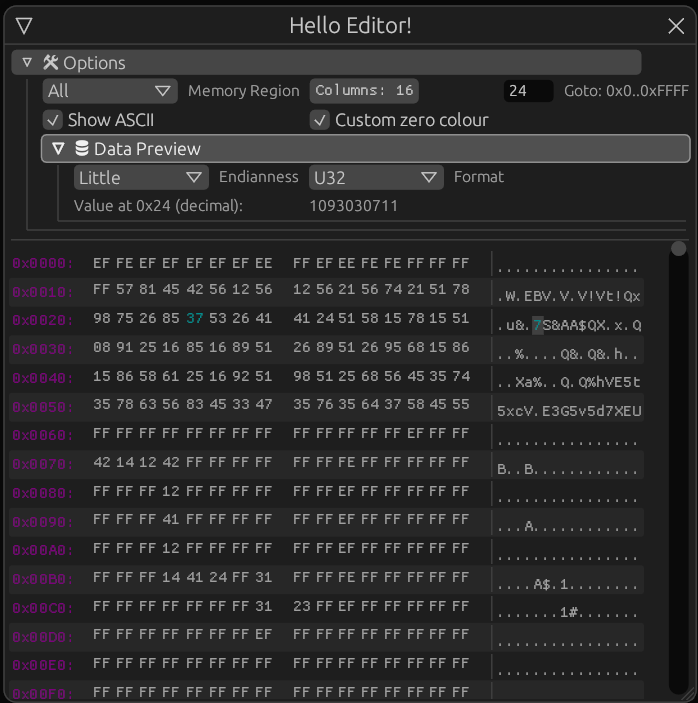
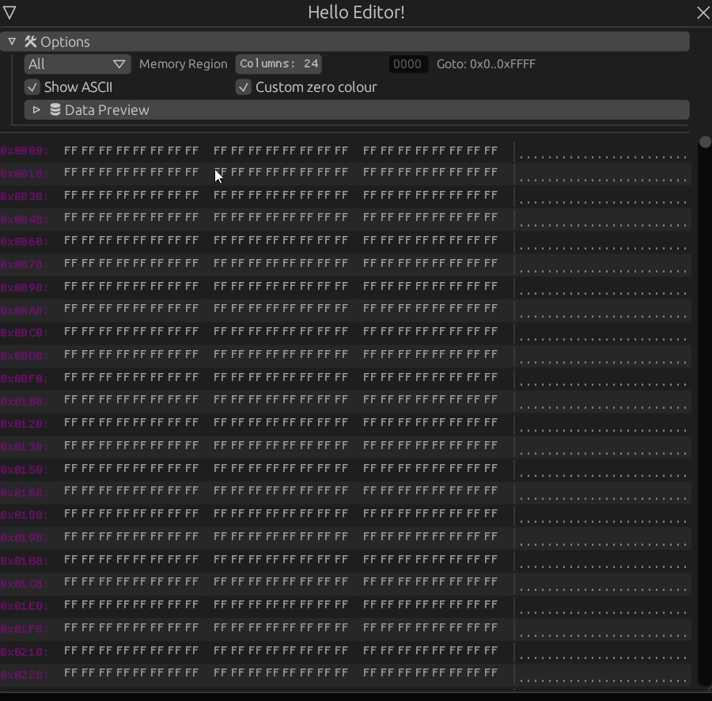

# Egui Memory Editor
This is a simple memory editor/viewer utility for the immediate mode UI library [egui](https://crates.io/crates/egui)



## Features
* Multiple memory regions with different address ranges can be created.
* Can jump to an arbitrary address using the goto functions.
* Can select certain values in the main UI by right-clicking, which you can then see in the `Data Preview` section.
* Can have an optional write function to allow editing fields by left clicking on them.

## Usage
It's best to look at the example in the `examples/` folder, but one can initialise the editor with any struct of their choosing.

For example, a custom memory struct:
```rust
let mut memory = Memory::new();
// Initialise with read function
let mut memory_editor = MemoryEditor::<Memory>::new(|memory, address| memory.read_value_at(address))
    .with_address_range("All", 0..0xFFFF)
    .with_write_function(|memory, address, value| memory.write_value_at(address, value))
    .with_window_title("Hello Editor!");

// In your egui rendering simply include the following:
memory_editor.window_ui(ctx, &mut memory);
```

## Running example
To run the example do the following:

1. `git clone https://github.com/Hirtol/egui_memory_editor`
2. `cd egui_memory_editor`
3. `cargo run --example simple --release`

## Feature Showcase

